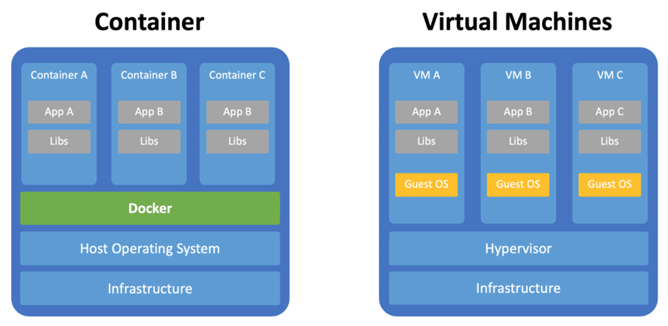
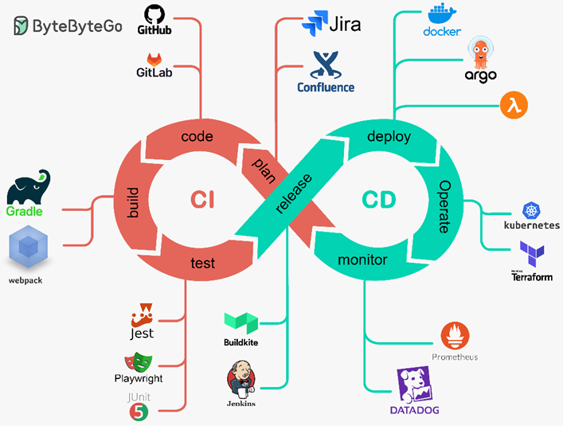
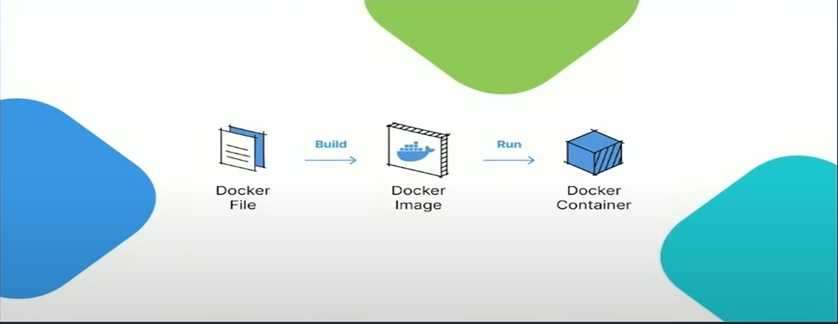
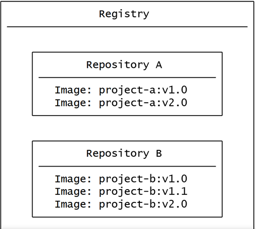

# What is Docker?

Docker is an **open-source platform** designed to help developers build, ship, and run applications consistently **across different environments**. It uses **containers**, which are lightweight, portable units of software that include everything needed to run an application, including code, runtime, libraries, and system dependencies.

# Why Do We Use Docker?

1. **Portability**:
   - Containers ensure the application **behaves the same** on development, testing, and production systems.

2. **Isolation**:
   - Containers are isolated from the host system and other containers, **reducing conflicts between dependencies**.

3. **Efficiency**:
   - Containers share the host operating system's kernel, making them **lightweight** compared to virtual machines (VMs).

4. **Speed**:
   - Containers start up almost instantly, unlike VMs which require an OS boot.

5. **Scalability**:
   - **Easily scale applications** up or down by adding/removing containers.

6. **Simplified CI/CD**:
   - Docker integrates well with CI/CD pipelines, making application deployment faster and more reliable.

## What is CI/CD

CI/CD means **continuous integration** and **continuous delivery/deployment**

### Continuous Integration (CI):
- Think of CI as **automatically** testing and validating your code changes whenever you push them to your repository.
- Example: **assert** model.score(test_data) >= 0.85 (It will raise an AssertionError), **assert** keyword is used when **debugging code**

### Continuous Delivery/Deployment (CD):
- This is about **automatically deploying** your code and models to different environments.

### Common Tools for Python Data Science CI/CD:
- GitHub Actions or GitLab CI for automation
- Docker for containerization
- MLflow for model tracking and deployment
- DVC for data version control
- pytest for testing

### Image Explanation In Python

#### CI (Continuous Integration) Phase:

1. Code:
   - GitHub/GitLab for version control
   - VS Code and Jupyter for development
   - Version control for both code and notebooks

2. Build:
   - Poetry/Conda for dependency management
   - requirements.txt for simple deployments
   - Virtual environment management

3. Test:
   - pytest for unit testing
   - Great Expectations for data validation
   - MLflow for model testing

4. Plan:
   - DVC for data version control
   - MLflow for experiment tracking

#### CD (Continuous Deployment) Phase:

1. Deploy:
   - FastAPI for model serving
   - Docker for containerization
   - Kubernetes for orchestration

2. Operate:
   - Prometheus for metrics
   - Grafana for visualization

3. Monitor:
   - MLflow for model monitoring
   - Weights & Biases for experiment tracking

# Main Concepts in Docker

 

## Docker File
- A Docker file is a text file that **contains all the commands** needed to build a given image.
  - Used by the **Docker build** command to create a Docker image

## Docker Image
- A **Docker Image** is a lightweight, standalone, and executable package that includes everything needed to run a piece of software.
- It is **created from a Docker file** using the docker build command.
- Docker images are **immutable**—once built, they cannot be modified.
- You can store and share Docker images using a **Docker Registry**
- For **Read-only**

## Docker Container
- A **Docker Container** is a running instance of a Docker Image.
- Containers are isolated environments that:
  - Share the host OS kernel.
  - Have their own process space, file system, and network.
- Containers can be started, stopped, restarted, and deleted.
  - A container can be created from a Docker image using the docker run command.

## Registry
- An image registry is a **centralized location for storing and sharing** your container images
- **Registry vs. repository**
  - A **registry** is a centralized location that stores and manages container images, whereas a **repository** is a collection of related container images within a registry. Think of it as a folder where you organize your images based on projects. Each repository contains one or more container images.

## Docker Compose
- Docker Compose is a tool for defining and managing multi-container Docker applications.
- It allows developers to define their application's services, networks, and volumes in a single **YAML file** called docker-compose.yml

## Resources
- https://docs.docker.com/get-started/