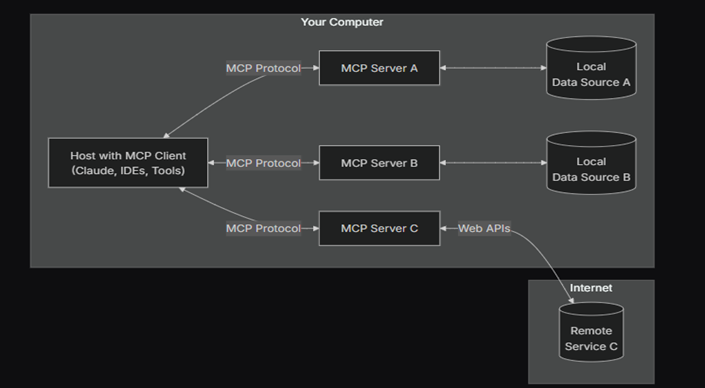
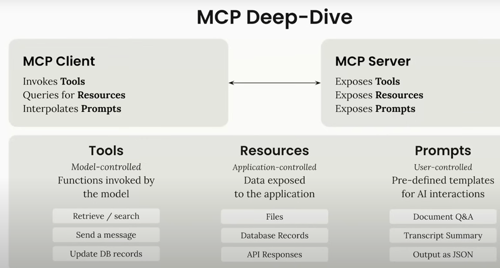

# Model Context Protocol (MCP)

## Introduction

### Definition

- **MCP** is an open protocol that standardizes how applications provide context to LLMs.
- Think of MCP as a **USB-C** port for AI applications
- MCP provides a standardized way to connect AI models to different data sources and tools.
- **Glue code** refers to code that is written to connect different software components or modules

### Why MCP?

MCP **helps you build agents and complex workflows on top of LLMs**. LLMs frequently need to integrate with data and tools, and MCP provides:

- A growing list of pre-built integrations that your LLM can directly plug into
- The **flexibility to switch** between LLM providers and vendors
- Best practices for **securing your data** within your infrastructure
- Solving **the M×N problem** that mean the systems required building custom connectors for every combination of AI application and data source

## Architecture

- **MCP Hosts**: Programs like Claude Desktop, IDEs, or AI tools that want to access data through MCP
- **MCP Clients**: Protocol clients that maintain 1:1 connections with servers
- **MCP Servers**: Lightweight programs that each expose specific capabilities through the standardized Model Context Protocol
- **Local Data Sources**: Your computer's files, databases, and services that MCP servers can securely access
- **Remote Services**: External systems available over the internet (e.g., through APIs) that MCP servers can connect to

## Limitations

1. **Lack of a Built-In Authentication Standard**:
   > MCP does not come with an out-of-the-box secure authentication scheme. Developers must implement security (for example, OAuth, API tokens, or role-based access controls) separately on top of MCP, which can lead to inconsistent security practices across implementations.

2. **Incomplete Error Handling and Robustness Guidelines**
   > The protocol leverages JSON-RPC for messaging, yet it leaves specifics like error handling, rate-limit management, and recovery from failed connections to the individual implementers.

## Does the MCP Replace Agents?

- **Model Context Protocol (MCP)**: This is typically used in the context of managing how models (especially LLMs) interact with their surrounding systems, providing structure for the flow of data, instructions, and responses. It ensures the model has the necessary context to generate useful responses based on the information it receives. **MCP helps define how models should understand and retain context**.

- **Agents**: In the context of artificial intelligence, agents often refer to autonomous systems or entities that can act on behalf of a user or interact with an environment. They can be rule-based or use models (like LLMs) to make decisions and take actions. Agents can leverage protocols like MCP to manage context effectively during their interactions with users or other systems.

## Why there is a Resource and Prompt

- It is not about just giving the model more context, it is about giving the application a richer way to interact with the various capabilities the server wants to provide.
- If I am a server developer and I want a standard way for people to talk to my application.
- Note: It supports **dynamic prompts**

## Official Integrations

- You can find all the integrations [here](https://github.com/modelcontextprotocol/servers)

## MCP Inspector

- **MCP inspectors** are essentially diagnostic and monitoring tools within the Model Context Protocol ecosystem.
- They are designed to allow developers and system integrators to inspect, analyze, and debug the context flows and interactions that occur when MCP is used to manage how AI models interact with external resources and actions.
- MCP **inspector is not a standalone replacement for the MCP functions,** but a complementary tool designed to provide transparency, ensure proper protocol adherence, and aid in the rapid troubleshooting of issues related to context management within MCP-enabled environments.

## Notes

- There is no best practice number of tools but in my experience 50-100 tools, by the way you can create a **tool that searches on the tools** or use the **Hierarchy architecture**
- There is an **MCP Autogenerated** that is produced by Klein

## References

- Documentation: [https://modelcontextprotocol.io](https://modelcontextprotocol.io)
- YouTube: [https://www.youtube.com/watch?v=kQmXtrmQ5Zg](https://www.youtube.com/watch?v=kQmXtrmQ5Zg)
- Framework: [https://github.com/lastmile-ai/mcp-agent](https://github.com/lastmile-ai/mcp-agent)
