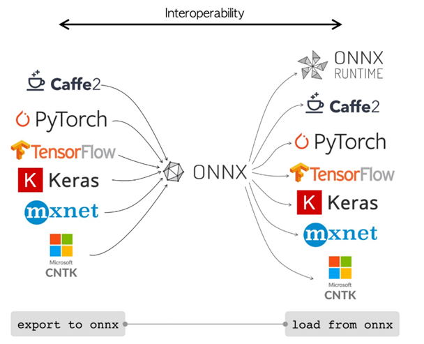
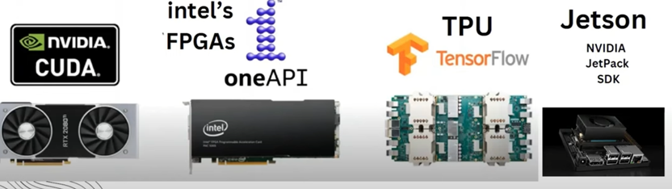

# Introduction

## Definition

ONNX (Open Neural Network Exchange) is an open-source format for representing machine learning and deep learning models.

It allows models **trained in different frameworks** (like PyTorch, TensorFlow, Scikit-learn, etc.) and **exported and used in various runtimes**, optimizing performance and interoperability.

## Why do we use it



- **Interoperability**: ONNX enables **seamless transfer of models** between different ML frameworks and hardware environments.
- **Optimization**: It **supports inference optimizations**, making models run faster on various hardware (CPU, GPU, FPGA, etc.).
- **Portability**: ONNX models can be **deployed across different platforms** without being tied to a specific framework.



## ONNX Runtime

- **ONNX Runtime (ORT)** is a high-performance, cross-platform engine for running machine learning models trained in various frameworks (like PyTorch, TensorFlow, Scikit-learn) that have been converted to the **ONNX** format
- **Cross-Platform Support** that run on Windows, Linux, macOS, iOS, Android, and Supports cloud, edge, and on-premises environments

## ONNX Support Types

### Tensor type:
- Int8, int16, int64
- uint8, uint16, uint32, uint64
- float16, float, double
- bool
- string
- complex64, complex128

### Non-tensor types:
- Sequence
- Map

# ONNX Example with TensorFlow

## Section 1: Training a Simple Model

```python
import tensorflow as tf
from tensorflow.keras.models import Sequential
from tensorflow.keras.layers import Dense
from sklearn.datasets import load_iris
from sklearn.model_selection import train_test_split
from sklearn.preprocessing import OneHotEncoder

# Load and prepare the dataset
iris = load_iris()
X = iris.data
y = iris.target.reshape(-1, 1)

# One-hot encode the target variable
encoder = OneHotEncoder(sparse=False)
y = encoder.fit_transform(y)

# Split the data into training and test sets
X_train, X_test, y_train, y_test = train_test_split(X, y, test_size=0.2, random_state=42)

# Build the model
model = Sequential([
    Dense(10, activation='relu', input_shape=(X_train.shape[1],)),
    Dense(10, activation='relu'),
    Dense(y_train.shape[1], activation='softmax')
])

# Compile the model
model.compile(optimizer='adam', loss='categorical_crossentropy', metrics=['accuracy'])

# Train the model
model.fit(X_train, y_train, epochs=50, batch_size=5, verbose=2)

# Evaluate the model
loss, accuracy = model.evaluate(X_test, y_test, verbose=2)
print(f'Test Accuracy: {accuracy:.4f}')

# Save the model in TensorFlow format
tf_model_path = './output/iris_model_tf'
model.save(tf_model_path)
print(f'TensorFlow model saved to {tf_model_path}')
```

## Section 2: Conversion to ONNX

```python
import tf2onnx
import onnx

# Define the model path
onnx_model_path = './output/iris_model.onnx'

# Convert the TensorFlow model to ONNX
spec = (tf.TensorSpec((None, X_train.shape[1]), tf.float32, name="input"),)
output_path = tf2onnx.convert.from_keras(model, input_signature=spec, opset=13, output_path=onnx_model_path)

print(f'Model saved to {onnx_model_path}')
```

### Key Components:

- **tf2onnx**: This is a Python library that converts TensorFlow models to the ONNX
- **onnx**: This is the core ONNX library used to manipulate ONNX models, including loading, saving, validating, and performing
- **tf.TensorSpec**: A TensorFlow class that specifies the shape, data type, and name of a tensor input.
  - Shape (None, X_train.shape[1]):
    - **None** means the batch size is flexible (dynamic). The model can process any number of samples at once (batching).
    - X_train.shape[1] specifies the number of features in the input data (e.g., for the Iris dataset, it would typically be 4 for sepal length, sepal width, petal length, and petal width).
- **opset=13**: Specifies the ONNX Operator Set (opset) version to use during conversion.

## Netron App

- **Netron** is a **viewer** for neural network, deep learning and machine learning models.
- Used to visualize the ONNX model

# Resources

- https://netron.app/
- https://github.com/lutzroeder/netron?tab=readme-ov-file
- https://www.youtube.com/watch?v=Ij5MoUnLQ0E
- https://github.com/AmrAbdellatif/ONNX_Course_material/blob/master/tensorflow%20to%20onnx/tf_walkthrough.ipynb
